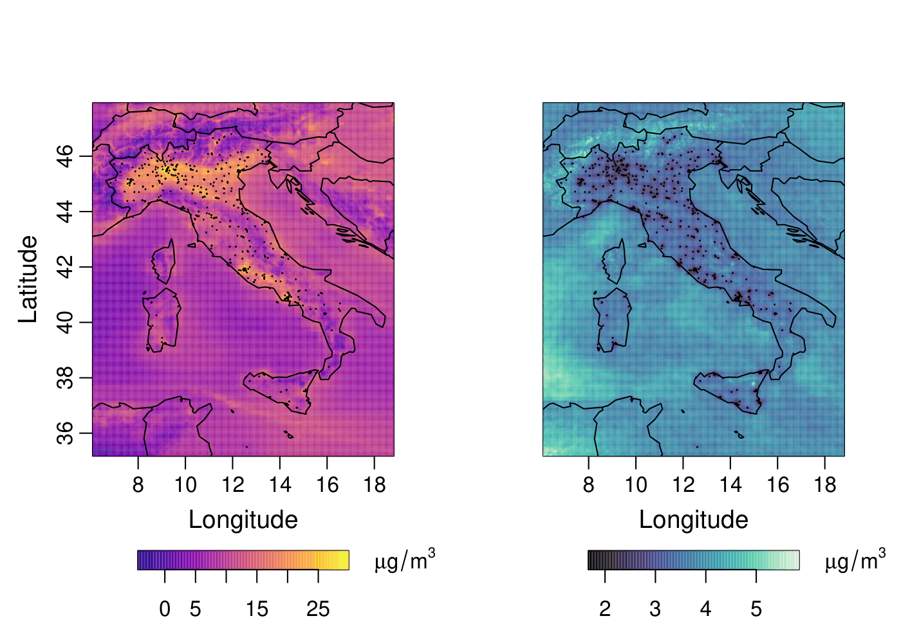

# Amortized Transfer Learning for Non-Stationary Italian Air Quality Data 

This repository contains the code for the article: 

*A Non-stationary, Amortized, Transfer Learning Approach for Modeling Italian Air Quality*

 **by**:  Alessandro Fusta Moro, Antony Sikorski, Daniel McKenzie, Alessandro Fassò, and Douglas Nychka.
 
  You'll find tutorial notebooks, data-generation scripts, training and evaluation procedures, and all experiments on nitrogen dioxide ($\text{NO}_2$) concentration/atmospheric pollution data. The paper can currently be found on [this link]([[https://arxiv.org/](http://arxiv.org/abs/2604.18823)](http://arxiv.org/abs/2604.18823)). 

<p align="center">
  
<p align="center"><em>Left: predicted nitrogen dioxide concentrations over Italy for November 1, 2023. Right: accompanying standard error. </em></p>

---

## Installation

Prior to running this code, one will need to download `Python`, `R` and either `RStudio` or `Positron`, clone this repository, and install all necessary dependencies. 

- **R:** The `R` programming language may be downloaded [here](https://cran.r-project.org/bin/windows/base/). We strongly recommend [`Positron`](https://positron.posit.co/download.html) or [`RStudio`](https://posit.co/download/rstudio-desktop/) for opening and working with the `R` scripts (training data and synthetic field generation). 

- **Python:** The `Python` programming language may be downloaded [here](https://www.python.org/downloads/). We use [`uv`](https://docs.astral.sh/uv/getting-started/installation/) as our package manager. 

- **Cloning this repo:** This repository can be cloned by running the following in your terminal:
   ```
   git clone https://github.com/afustamo/ItalyAQ-amortized-transfer-learning.git
   ``` 

- **Dependencies:**
  - For `R`: All dependencies can be downloaded by opening and running `R_scripts/required_packages.R`.

  - For `Python`: You can install dependencies and create a virtual environment using [`uv`](https://docs.astral.sh/uv/) by running 

    ```
    uv sync
    ```
   
    If you do not wish to use `uv`, you can create a virtual environment however you wish, and run 

    ```
    pip install -r requirements.txt
    ```

## Getting Started

To get started with our code, download the necessary data, network weights, network outputs, and experimental results from [this Google Drive folder](https://drive.google.com/drive/folders/1x8TdZ9QZU2uklLXStRv-C4HEbm4lk44b?usp=sharing):

1. Prepare `data/` and `results/` folders: Move the files from the `data/` folder in Google drive to the `data/` folder in your local copy of the repository. Do the same for `results/`.

2. Optionally, run 

   ```
   make test
   ```

   to run the repo tests, and run 

   ```
   make help
   ``` 

   to print out other available commands. 

## Reproducing Results

### STUN Estimator

- Prior to reproducing any results, one must ensure they have a trained STUN (SpatialTransUNet) estimator. The weights for the STUN estimator can be downloaded from [this Google Drive folder](https://drive.google.com/drive/folders/1x8TdZ9QZU2uklLXStRv-C4HEbm4lk44b?usp=sharing). Optionally, one can also choose to generate the training data themselves using `R_scripts/i2i_datagen.R`, and then train STUN using `notebooks/i2i_trainloop.py`. 
- The notebook in `notebooks/i2i_demo.ipynb` can also serve as a helpful tutorial for the training procedure. 
- More detailed instructions can be found in the `README` of the [LatticeVision repository](https://github.com/antonyxsik/LatticeVision/tree/main), where the STUN estimator, and other image-to-image (I2I) neural estimators for big, non-stationary data were first introduced. 

### ARX(1) Mean Component

In order to reproduce the experimental results, one must first run `R_scripts/CTM_ARX1.R`, which creates the ARX(1) residuals from which parameter fields will be estimated. 

### Parameter Estimation

Parameter fields are then estimated using the trained STUN estimator in `notebooks/italy_aq_application.ipynb`. 

### CTM Reconstruction Experiment

The parameter fields can then be used to perform the CTM Reconstruction experiment in `R_scripts/CTM_prediction_exper.R`. This can be quite computationally intensive to do on your local machine for all of 2023, so we recommend modifying the loop to only run for a few chosen days. 

### Monitoring Station Experiments

The parameter fields are also necessary to perform all monitoring station experiments. Performing the experiments for all of 2023 is computationally expensive. An example that one can run on their laptop for a single day is provided in `R_scripts/station_prediction_example.R`, and the full experiment code (which is run on an HPC) is in `R_scripts/station_prediction_exper_HPC.R`. 


### Note: 
Almost all `R` scripts use the `R_scripts/helpful_functions.R` file, and many of the packages in the `R_scripts/required_packages.R` file. 


## Directory for Downloaded Datasets and other Files

Reproducing this work requires downloading and working with many datasets and files. Here is a guide/reference to make life a bit easier:  

### `data/` folder: 
- `cams_df_2023padded.rds`: This is the CTM data. It includes the ($\text{NO}_2$) concentrations, covariates, and ARX(1) predictions and residuals that the nonstationary LatticeKrig parameters will be estimated from. 

- `NO2_resid_df_2023padded.h5`: These are the ARX(1) residuals from which the parameters are estimated. 

- `NO2_resid_df_2023padded_norm.h5`: These are the normalized residuals. 

- `pred_df_2023.rds`: The covariates and other data you will need to predict ($\text{NO}_2$) concentrations on the fine grid. 

- `eea_df_2023.rds`: This is the station data. It includes the ($\text{NO}_2$) concentrations and covariates. 

- `I2I_sample_data.h5`: Data used for the automated Github testing procedure and the `tests/` that occur when you run `make test`. 


### `results/` folder: 

- `STUN_param_df_2023padded.h5` The estimated LatticeKrig parameter fields. 
- `rmse_CTM_reconstruct.rds` and `predictions_CTM_reconstruct.rds`: Results from the CTM reconstruction experiment. 

#### `results/model_wghts/` folder: 

- `modelTransUNet_reps30_posRotaryPosEmbed.pth`: The weights for the trained STUN estimator. 

## Citation

Please use the following BibTeX to cite this work: 

```{bibtex}
{
Add citation when available.
}
```

## Related Links

- Spatial modeling for this work is done using the well known LatticeKrig package. Attached are links to both the package on [CRAN](https://cran.r-project.org/web/packages/LatticeKrig/index.html) and the [paper](https://www.tandfonline.com/doi/full/10.1080/10618600.2014.914946). 

- This work uses data from the GRINS_AQCLIM dataset. Attached are links to both the [dataset](https://zenodo.org/records/17605148) and [paper](https://arxiv.org/abs/2602.10749). 

- This work expands upon the *LatticeVision* neural estimation framework. Attached are links to both the [Github repository](https://github.com/antonyxsik/LatticeVision/tree/main) and [paper](https://arxiv.org/abs/2505.09803). 

